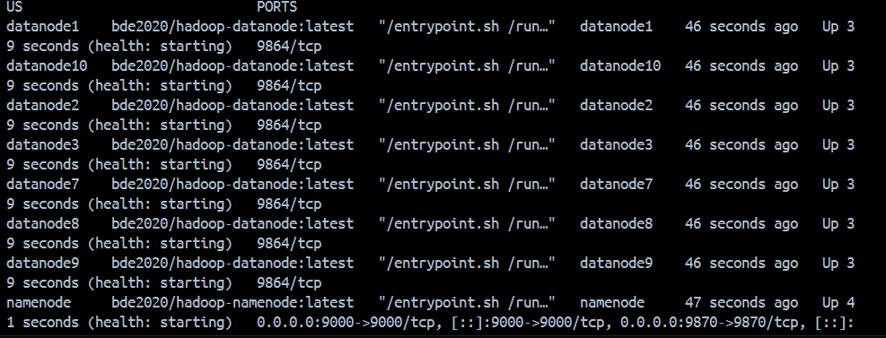

# Runtime Evidence Checklist


1. `docker compose ps` output showing:
   - `namenode`
   - `datanode1` through `datanode10`


   


2. HDFS health report:

   ```powershell
   docker exec namenode hdfs dfsadmin -report > evidence\hdfs-report.txt
   ```


3. HDFS file listing after upload:

   ```powershell
   docker exec namenode hdfs dfs -ls /data > evidence\hdfs-data-listing.txt
   ```


4. Upload script output:

   ```powershell
   python upload_to_hdfs.py --namenode http://localhost:9870 --local-dir ./data > evidence\upload-output.txt
   ```


5. Verification script output:

   ```powershell
   python verify_hdfs.py --namenode http://localhost:9870 --local-dir ./data > evidence\verify-output.txt
   ```


6. screenshot of `http://localhost:9870` :
   - Namenode web UI showing the live datanodes.


